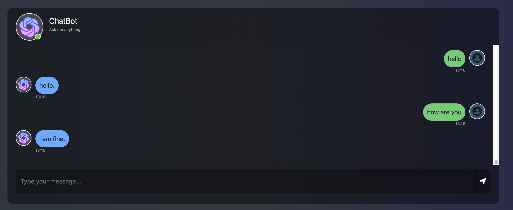

# Simple chat bot - Pytorch

<p align="center">
  
</p>

## Features

### Supported features
- Training simple chat model using seq2seq architecture
- Convert Torch to onnx
- Inference mode: pt (pytoch backend), onnx
- Simple web chat demo using flask

### TODO:
- [ ] Download data and pretrained model from https://drive.google.com/drive/folders/1z1e13sDAK6mQZVwZD0OvZaavXI8WRBIu?usp=sharing put to:  
data path: chatbot/data  
pretrained path: chatbot/app/model/storage
- [ ] Install necessary package: pytorch, flask, onnxruntime
- [ ] Train and convert model using training_and_convert_onnx.ipynb notebook.

### RUN APP 
# To use onnx, run: 
```zsh
export INFERENCE_BACKEND=onnx
```
```zsh
cd app/
python3 app.py
```